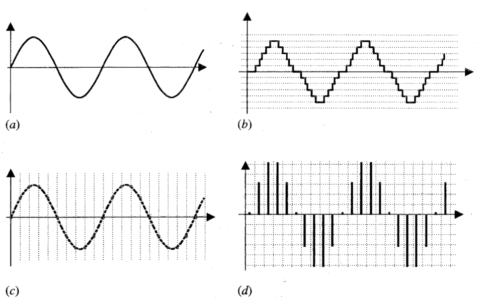
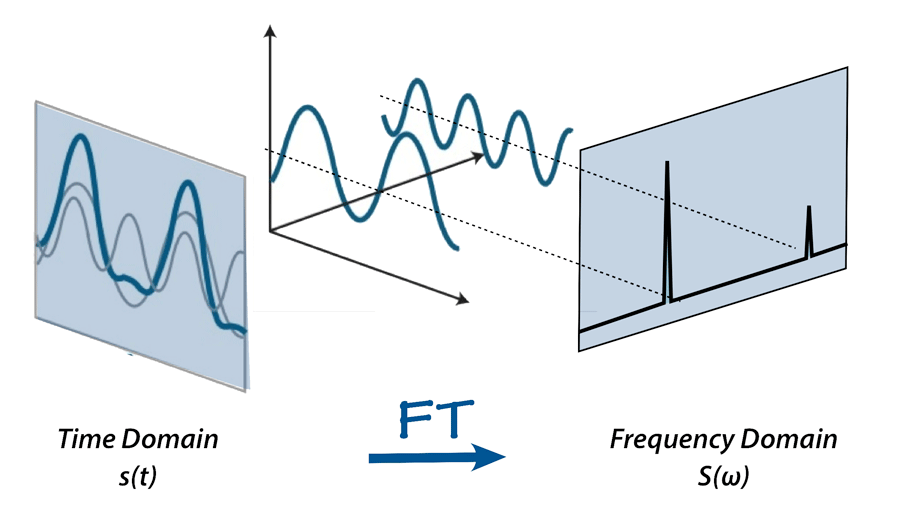
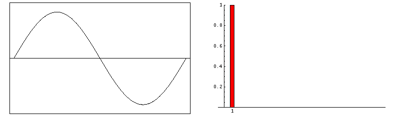
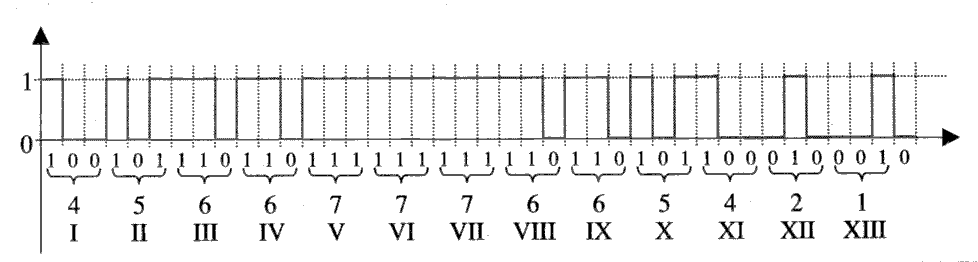

Secondo la fisica, il suono è una vibrazione itinerante, cioè un'onda che si muove attraverso un mezzo
come l'aria. L'onda sonora trasferisce energia da particella a particella fino a quando non viene
finalmente "ricevuta" dalle nostre orecchie e percepita dal nostro cervello. I due parametri
fondamentali per descrivere un suono sono l'ampiezza (ciò che chiamiamo anche volume) e l'altezza (o
frequenza, la misura delle oscillazioni dell'onda per unità di tempo).

La recente crescita tecnologica ha comportato un deciso miglioramento delle performance di velocità e
di densità di circuiti e memorie, rendendo possibile la rappresentazione digitale di grandi quantità di
dati, compresi i segnali acustici. Nello specifico la digitalizzazione del suono ha comportato una
serie di trasformazioni a partire dagli anni '80, che hanno interessato sia i professionisti che i
fruitori di musica. Dall'introduzione sul mercato del primo CD per uso commerciale nel 1982 ad oggi si
è assistito alla nascita (e fine) di numerosi supporti digitali (Digital Audio Tape, MiniDisc, USB,
DVD, HDD, SSD, Cloud).

Ciò ha permesso che il trattamento e il processo numerico dei segnali digitali[^1] assumesse una netta
preponderanza rispetto a quello analogico: una successione di numeri che rappresentano l'ampiezza del
segnale in precisi e ravvicinati istanti di tempo è molto più precisa e affidabile di
un'approssimazione non discreta acquisita su un nastro magnetico. Quindi si è dovuto progettare dei
sistemi in grado di convertire il suono analogico in una successione di valori che vadano a descrivere
i vari parametri del suono (altezza, intensità, timbro). Osservando la rappresentazione cartesiana di
un'onda sonora nel dominio del tempo si nota come l'asse delle ordinate descriva l'ampiezza e l'asse
delle ascisse metta in evidenza la frequenza a cui si muove l'onda. La conversione del suono da
analogico a digitale avviene quindi sui due livelli suddetti: si parlerà di campionamento per la
frequenza e quantizzazione per l'ampiezza.

<figure>

<figcaption>a) segnale analogico, b) quantizzato, c) campionato, d) quantizzato e campionato</figcaption>

</figure>

## Campionamento

Il campionamento corrisponde all'individuazione periodica della presenza di segnale da parte della
macchina e consente di analizzare e ricostruire le frequenze in ingresso.

## Quantizzazione

La quantizzazione è il processo di sostituzione di ogni numero reale della sequenza di campioni con
un'approssimazione da un insieme finito di valori (solitamente $2^{16}$).

## La trasformata di Fourier

Oltre alla rappresentazione del suono nel dominio del tempo, esiste la possibilità di rappresentarne le
stesse proprietà anche nel dominio della frequenza. Questo sistema venne studiato da Joseph Fourier,
che definì anche come passare dalla rappresentazione nel dominio del tempo a quello nel dominio della
frequenza, questo processo è detto _trasformata di Fourier_ o _Fourier Transform_ (FT).

Quando il segnale di partenza è in formato digitale si può applicare la _Trasformata Discreta di
Fourier_ (DFT). L'idea sottostante alla DFT è che lo spettro sia campionato in frequenza così come la
forma d'onda digitale viene campionata nel tempo.

Matematicamente parlando, la relazione tra $N$ campioni nel dominio del tempo
$x_0, x_1, ..., x_{N-1}$ e $N$ numeri complessi della trasformata discreta di Fourier
$X_0, X_1, ..., X_{N-1}$ è descritta dalla formula:

$$
X_k = \sum_{n = 0}^{N-1} x_n e^{-ik\frac{2\pi}{N}n}\quad k=0,..., N-1
$$

dove $i$ è l'unità immaginaria e $e^{i\frac{2\pi}{N}}$ è una radice dell'unità primitiva $N$-esima.

## Pulse Code Modulation

Il passo finale della digitalizzazione, che ingloba i processi di quantizzazione e campionamento, è la
generazione del codice associato al campione.

Esistono molti modi di codificare un segnale. Il modo di cui ci siamo concettualmente serviti senza
saperlo è il _Pulse Amplitude Modulation_ (PAM), per il quale un impulso occorre a ogni intervallo di
campionamento, e l'ampiezza della forma d'onda è un valore digitale che corrisponde all'ampiezza
analogica. Ma il modello considerato standard per la codifica digitale è il cosiddetto _Pulse Code
Modulation_ (PCM): l'informazione viene racchiusa in gruppi di bit che rappresentano il variare
dell'ampiezza nel tempo, l'uno corrisponde a presenza di segnale, mentre lo 0 ne descrive l'assenza.

La codifica PCM è usata in tutti i settori dell'archiviazione e della trasmissione digitale dei dati.
La comodità di questa rappresentazione è che si possono facilmente operare controlli o modifiche sui
bit senza perdere il segnale originale, inoltre è molto meno sensibile al rumore delle altre
codificazioni.

[^1]:
    DSP sta per _Digital Signal Processing_ ed è un termine usato per indicare l'elaborazione
    elettrica dei segnali, permettendo al computer di analizzarli. Questo tipo di operazioni sta alla
    base di molti campi di applicazione: dal sound engineering alle telecomunicazioni, passando per la
    computer vision.
